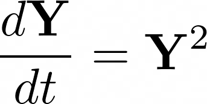

# Community detectability and structural balance dynamics in signed networks

Dynamical signed networks are networks with both positive and negative connections that change over in response to influences. Networks under the influence of structural balance dynamics tend to form into either two antagonistic communities or one large harmonious community over time. We use simulations to show how networks that are initially complex with many clusters always converge to a low-dimensional structure with either 1 or 2 clusters and that these clusters are assortative in certain parameter regimes.  The final network states are a function of initial network statistics and we show how the contrast eigenvalue of the system breaks away from the remainder of the spectral band as one increases certain model parameters, generating a leading eigenvalue with assortative structure, and therefore a final network composed of this same structure. 

This notebook reproduces select results from the paper "Community detectability and structural balance dynamics in signed networks.

## Table of contents
1. [Structural Balance Dynamics](#structural_balance)
2. [Separation of signal eigenvalues](#signal_eigvals)

### Structural Balance Dynamics 

According to structural balance theory nodes in unstable states will tend to more stable states over time. These dynamics are modeled with the dynamical system 

Where __Y__ is the connectivity matrix. We simulate the dynamics of a stochastic block model matrix and show the connectivity over time as well as the initial and final state of the matrix.

### Separation of signal eigenvalues

When the contrast eigenvalue separates from the spectral band on the leading eigenvalue side, the network converges to assortative clusters instead of random clusters.  When the homogeneous eigenvalue separates from the spectral band on the leading eigenvalue side, the network converges to a universally harmonious state.

